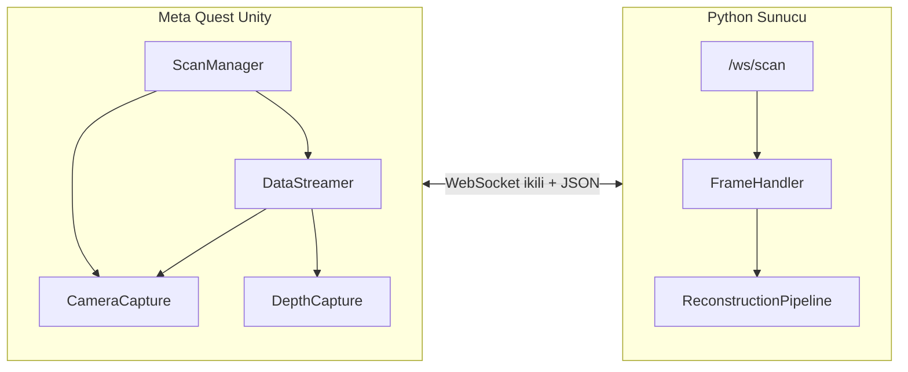

# MetaScan — Meta Quest ile 3D Nesne Taraması ve Görüntü İşleme Pipeline’ı

Bu depo, **görüntü işleme** ve **bilgisayarlı görü** kavramlarını bir **MR/VR ortamından (Meta Quest)** akış olarak kullanan ders projesidir: passthrough/eldeki kameradan görüntü + (isteğe bağlı) derinlik + baş/poz verisi bilgisayara aktarılır; sunucu tarafında **kalite kontrolü**, **oturum yönetimi** ve **3D yeniden yapılandırma** yapılır.

---

## Özet Mimari

Sistem üç ana bloktan oluşur:

| Bileşen | Teknoloji | Rol |
|--------|-----------|-----|
| **İstemci (başlık)** | Unity (C#), Meta XR SDK (`META_XR_SDK`) | Tarama akışını yönetir, kare yakalar, ikili protokolle WebSocket üzerinden sunucuya gönderir |
| **Sunucu** | FastAPI + Uvicorn, WebSocket | Kareleri doğrular, diske kaydeder, COLMAP/Open3D ile mesh üretimini tetikler |
| **Web görüntüleyici** | Statik HTML (`viewer/`) | Sunucunun `/viewer` üzerinden servis ettiği arayüz |



---

## Dizin Yapısı

```
meta_scan/
├── QuestScanner/          # Unity projesi (Android / Quest hedefli build)
│   └── Assets/Scripts/    # MetaScan namespace — tüm istemci mantığı
├── server/                # FastAPI sunucusu
│   ├── main.py
│   ├── frame_handler.py
│   ├── reconstruction.py
│   ├── config.py
│   └── data/              # Oturumlar ve exportlar (çalışma zamanında oluşur)
├── viewer/                # Tarayıcı 3D model görüntüleyici (index.html)
└── README.md
```

---

## İstemci (Unity — `QuestScanner`)

Tüm özel betikler `MetaScan` ad alanında toplanmıştır. Sahne **`SceneBootstrapper`** ile kurulur: `ScanSystem` adlı kök nesneye sırayla MR, giriş, UI, seçim, akış ve yöneticiler eklenir.

### Çekirdek betikler ve sorumlulukları

| Script | Görev |
|--------|--------|
| **SceneBootstrapper** | OVRCameraRig kontrolü; `ScanSystem` altında bileşenleri oluşturur |
| **MRSetup** | Passthrough (`OVRPassthroughLayer`), şeffaf arka plan kamera ayarı, `Stage` takip başlangıcı |
| **ScanManager** | **Durum makinesi**: Idle → Connecting → Connected → Selecting → Scanning → Processing → Complete / Error |
| **ControllerManager** | Sol/sağ el anchor’ları (`OVRCameraRig` veya düzenleyici için sahte anchor); OVR tetik/grıp olayları; haptik |
| **HandUIManager** | Sol el grip ile açılıp kapanan **World Space Canvas** (bağlantı IP/port, Tara/Dur, ilerleme çubuğu) |
| **VRUIPointer** | Panel görünürken sağ kontrolciden UI’ye laser; **Physics.Raycast** + dünya noktasını `RectTransform` içinde test; `Button.onClick.Invoke` |
| **ScanPointer** | Sahne nesnelerine lazer (**Physics.Raycast**), tarama sırasında renk/mod değişimi |
| **ObjectSelector** | Sağ tetik basılı tutarak merkez + sürükleyerek yarıçap ile **seçim küresi**; üç halka `LineRenderer` |
| **PointCloudVisualizer** | Kabul edilen kare geri bildirimine göre **parçacık sistemi** ile “taramaCoverage” görselleştirmesi |
| **CameraCapture** | `RenderTexture` + `Camera.Render` ile kare yakalama, **JPEG** (`EncodeToJPG`), varsayılan **pinhole iç parametreleri** (fx,fy,cx,cy); baş pozu/quaternion ile birlikte `CapturedFrame` |
| **DepthCapture** | `META_XR_SDK` ile `_EnvironmentDepthTexture` okuma; float metre → uint16 mm byte dizisi (`GetDepthData`) |
| **DataStreamer** | `System.Net.WebSockets.ClientWebSocket` tabanlı hafif istemci; **ikili çerçeve paketleme**, kuyruk (`maxQueueSize`), sunucudan gelen JSON geri bildirimi basit string ayrıştırma ile |

### Durum makinesi (ScanManager)

- **Idle**: Sunucuya bağlan hazır.
- **Connecting / Connected**: WebSocket `ws://IP:8765/ws/scan`.
- **Selecting**: Kullanıcı nesne alanını seçer; `PointCloudVisualizer.ClearPoints()` temizlenir.
- **Scanning**: `CameraCapture.StartCapturing()` + `DataStreamer.StartSession("scan")`; hedef kare sayısı (varsayılan 200), minimum kare (`minFramesRequired`, 30) ve zaman aşımı (`scanTimeout`, 300 s).
- **Processing / Complete**: Sunucunun kabulü yeterliyse kullanıcıya “işleniyor / tamam” mesajı; gerçek 3D üretimi sunucuda veya REST ile tetiklenebilir.

### Kullanılan görüntü/görsel yapılar (ders açısından)

- **Dünya uzayı UI**: Billboard olmayan düz canvas; küresel seçim görselleştirmesi ve lazer için **projeksiyon geometrisi** (ışın → düzlem).
- **Kamera modeli**: Pinhole yaklaşımı; iç parametreler paketle gönderilir (gerçek cihazda OVR kamerasından kalibre edilerek güncellenebilir — `CameraCapture.SetIntrinsics`).
- **JPEG kodlama**: Bant genişliği/disk için sıkıştırma (Unity tarafında kalite; sunucuya kayıtta OpenCV ile tekrar yazım — kalite 95).

---

## Sunucu (Python — `server/`)

### Giriş noktası: `main.py`

- **FastAPI** uygulaması; **CORS** açık (web viewer için).
- **Yaşam döngüsü**: Başlangıçta adresleri loglar; kapanırken rekonstrüksiyon görevleri iptal edilir.
- **Statik dosyalar**: `viewer/` → `http://host:8765/viewer`, `data/exports` → `/exports`.

### REST uçları (özet)

| Metod | Yol | Açıklama |
|-------|-----|----------|
| GET | `/api/health` | Sağlık kontrolü |
| GET | `/api/sessions` | Oturum listesi (`session_metadata.json` veya `images/*.jpg` sayımı) |
| GET | `/api/sessions/{id}` | Oturum detayı |
| POST | `/api/sessions/{id}/reconstruct?method=full\|colmap\|tsdf` | Ark planda rekonstrüksiyon görevi |
| GET | `/api/sessions/{id}/reconstruction/status` | Görev durumu |
| GET | `/api/sessions/{id}/exports` | Export dosya listesi ve URL’ler |

### WebSocket: `/ws/scan`

1. İstemci: `{"action":"start_session","name":"..."}` → sunucu: `session_started` + `session_id`.
2. İstemci ikili gövdede sırayla kare gönderir.
3. Sunucu her kare için `frame_result` (kalite, toplam kabul edilen kare vb.) döner.
4. `{"action":"stop_session"}` ile oturum kapanır; metadata ve COLMAP girdisi hazırlanır.

### `frame_handler.py` — Görüntü işleme ve depolama

- **Çerçeve ayrıştırma**: `FRAME_MAGIC = b"MSF\x01"`, başlık 32 bayt (`struct` ile little-endian): indeks, zaman damgası, JPEG uzunluğu, derinlik uzunluğu, poz uzunluğu, içparam uzunluğu.
- **Görüntü çözme**: OpenCV `imdecode`.
- **Kalite kontrolü** (`_check_quality`):
  - **Bulanıklık**: Gri tonlamada **Laplacian varyansı** (`cv2.Laplacian`). Eşik: `BLUR_THRESHOLD` (`config.py`, varsayılan 100).
  - **Pozlama**: Gri ortalaması `EXPOSURE_MIN`–`EXPOSURE_MAX` (30–230) aralığı dışına çıkmamalı.

Bu iki ölçüt, klasik **no-reference görüntü kalitesi** ve **histogram/parlaklık analizi** ders bağlantıları için doğrudan örnek teşkil eder.

- **Kayıt**: `images/frame_XXXXXX.jpg`, isteğe bağlı `depth/depth_XXXXXX.raw`, `poses/pose_XXXXXX.json`, ilk çerçevede `intrinsics.json`.

### `reconstruction.py` — 3D yeniden yapılandırma

- **COLMAP** (PATH’te `colmap` veya `COLMAP_PATH`):
  - `feature_extractor`, `sequential_matcher`, `mapper`.
  - `prepare_colmap_input`: `cameras.txt` (PINHOLE), `images.txt` (bilinen quaternion + çeviri ile COLMAP’e ipucu), görüntüler için symlink/kopya.

- **Open3D TSDF birleştirme** (`ScalableTSDFVolume`):
  - RGB-D çiftleri, pozdan **dış parametre matrisi** (`_pose_to_extrinsic`).
  - Derinlik: uint16 mm, `depth_scale` 1000 → metre; `TSDF_DEPTH_MAX` ile kesim.

- **Dışa aktarım**: `trimesh` ile **OBJ, STL, GLB**; Open3D ile **PLY**.

- **Fallback**: Derinlik yoksa seyrek bulut oluşturulup PLY olarak yazılabilir; tam mesh için veri eksik kalabilir.

### `config.py` — Tek merkezi yapılandırma

Oturum dizinleri, kamera çözünürlüğü (1280×960), kalite eşikleri, TSDF voxel/trunc yüz simplifikasyon hedefi (`TARGET_FACE_COUNT`), ikili protokol sabitleri ve isteğe bağlı `SessionInfo` dataclass.

---

## İkili Çerçeve Protokolü (istemci ←→ sunucu)

Sıra (sunucu `config.py` ile uyumlu):

1. Magic 4 bayt: `MSF\x01`
2. `uint32` frame index, `float64` timestamp (saniye)
3. `uint32` × 4: JPEG, depth, poz, içparam uzunlukları
4. JPEG baytları
5. Depth (uint16 little-endian mm, sıralı düz dizi — genişlik×yükseklik)
6. Poz: 7× `float32` — px, py, pz, qx, qy, qz, qw
7. İçparam: 4× `float32` — fx, fy, cx, cy

---

## Kurulum ve Çalıştırma

### Sunucu

```bash
cd server
python -m venv .venv
.venv\Scripts\activate          # Windows
pip install -r requirements.txt
python main.py
```

Varsayılan dinleme adresi: `config.py` içinde `0.0.0.0` ve **8765** portu. Tarayıcı: `http://<PC_IP>:8765/viewer`.

**İsteğe bağlı tam pipeline**: Sistem PATH’inde [COLMAP](https://colmap.github.io/).

### Unity (Quest)

- Unity sürümü projenin `ProjectVersion.txt` ile uyumlu olmalıdır.
- **Meta XR** paketleri; derlemede **`META_XR_SDK`** scripting define grubu aktif olmalıdır (`DepthCapture`, `MRSetup`, vb. için).
- `SceneBootstrapper` içeren sahne; Android manifests’te internet ve headset kamera izinleri (`SceneBootstrapper.LogPermissions()` referansı).

PC ve Quest **aynı ağda** olmalı; güvenlik duvarında **8765** TCP dinlemesine izin verin.

---

## Bağımlılıklar (`server/requirements.txt`)

- **fastapi**, **uvicorn**, **websockets**: HTTP/WebSocket sunucusu
- **opencv-python-headless**, **numpy**, **Pillow**: görüntü çözümleme ve işleme
- **open3d**, **trimesh**: TSDF ve mesh export
- **aiofiles**, **python-multipart**: yardımcı

---

## Görüntü İşleme Dersi İçin Kavram Haritası

| Konu | Projede karşılığı |
|------|-------------------|
| Görüntü temsili (RGB, gri) | OpenCV BGR matrisi, Laplacian için gri dönüşüm |
| Kenar/odak (bulanıklık) | Laplacian varyansı eşiklemesi |
| Parlaklık/pozlama | Ortalama gri seviye eşikleri |
| Kamera modeli | Pinhole fx, fy, cx, cy; COLMAP PINHOLE |
| Çok görünümlü geometri | Çoklu kare + poz; SfM (COLMAP) veya derinlik füzyonu (TSDF) |
| Derinlik sensörü | Quest environment depth → mm’ye ölçekleme |
| Sıkıştırma | JPEG (istemci ve sunucu tarafı) |

---

## Bilinen Sınırlamalar / Notlar

- **CameraCapture** birincil olarak **RenderTexture + center eye camera** ile yakalar; gerçek passthrough sensörü için Meta Camera Access API entegrasyonu kodda yorum olarak bırakılmıştır.
- **DepthCapture** global `_EnvironmentDepthTexture` varlığına bağlıdır; yoksa derinlik boş gider ve sunucu **sadece renk + poz** ile sınırlı yolları kullanır.
- **MIN_OVERLAP_RATIO** `config.py`’de tanımlıdır; mevcut `FrameHandler` akışında **ardışık kare örtüşme kontrolü uygulanmıyor** — ileri geliştirme için uygun bir kanca.
- WebSocket istemcisi `SendAsync`’i beklemeden gönderir; yoğun ağda kuyruk ve geri baskı iyileştirilebilir.

---

## Özet

**MetaScan**, VR tarafında **durum yönetimi, MR passthrough, el tabanlı UI ve çok modlu veri** (renk, derinlik, poz) üretir; sunucu tarafında **klasik CV kalite filtreleri** ve **COLMAP / Open3D** ile **3D mesh** üretimine köprü kurar. Bu README, ders raporunda mimari, veri akışı ve görüntü işleme bileşenlerini tek yerden referans almanız için yazılmıştır.
